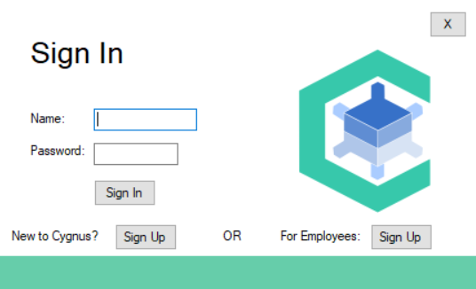
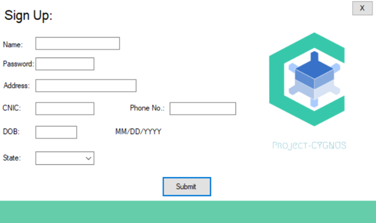
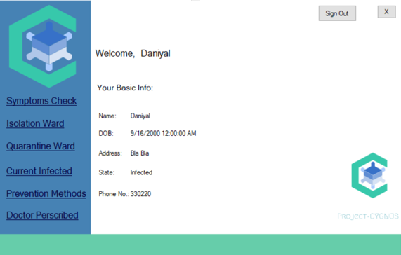
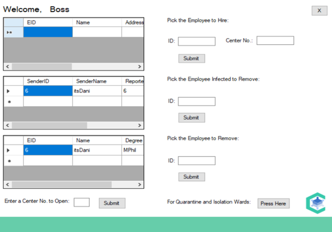

# ProjectCygnus_cs
Application handling database for Covid Related Patients

## Pre-Requisities
* Visual Studio - IDE
* Microsoft Access - Database
* Integrate database with the application

## **Setup**
* Clone the repository in your directory.
* Open the application in Visual Studio.
* Integrate the database equivalent to queries in the application.
* Execute the application.

### **Screenshots**

